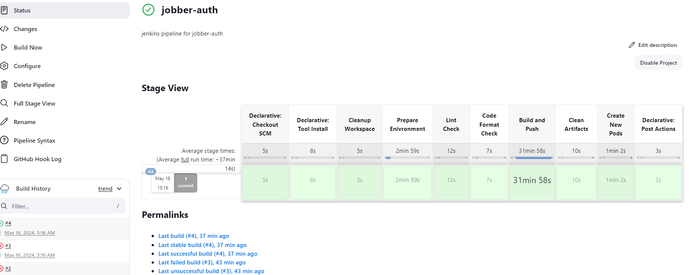
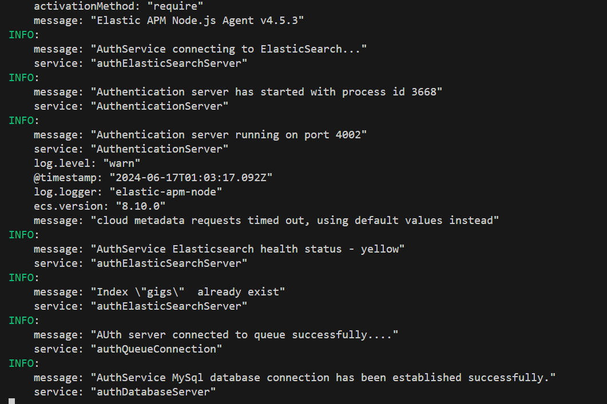

## Authentication Microservice

- The authentication microservice is responsible for creating users.
- A user that creates an account automatically becomes a buyer in the application.
- When a user successfully creates an account, an event is published from the `authentication service` to the `users service` so as to add buyer data to `mongodb`.
- Server side errors from the authentication microservice is sent to `elasticsearch` and can be viewed on `kibana`.
- Authentication service uses these tools as the main tools
  - `Your shared library`
  - `NodeJS`
  - `Express`
  - `Typescript`
  - `Rabbitmq`
  - `Elasticsearch`
  - `MySQL database`
  - `Sequelize`
  - `Json web token`
  - `Faker to create seed data`
- There are other packages that are used.
- You can update the version of `NodeJS` used inside the `Dockerfile` and `Dockerfile.dev`.
- Make sure you already have your own shared library published.

## JENKINS

## LOCAL SERVER

