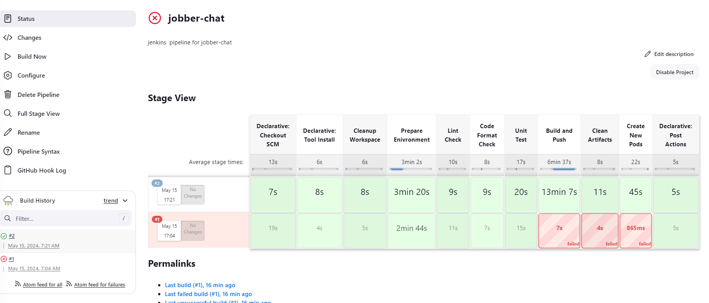
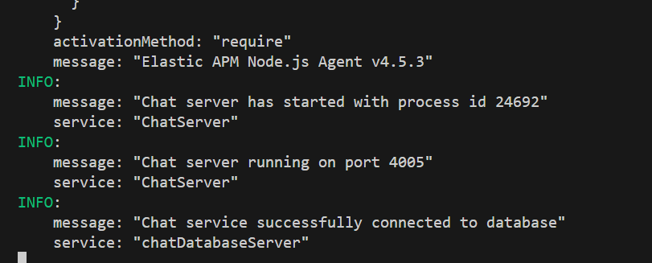

## Chat Microservice

- The chat microservice is responsible for communication between buyers and sellers.
- Buyers can send messages to sellers and sellers can respond.
- In this service, events are only `published` to other microservices.
- Server side errors from the chat microservice is sent to `elasticsearch` and can be viewed on `kibana`.
- Gig service uses these tools as the main tools
  - `Your shared library`
  - `NodeJS`
  - `Express`
  - `Typescript`
  - `Rabbitmq`
  - `Elasticsearch`
  - `MongoDB database`
  - `Mongoose`
  - `Json web token`
  - `SocketIO`
- There are other packages that are used.
- You can update the version of `NodeJS` used inside the `Dockerfile` and `Dockerfile.dev`.

## JENKINS

## LOCAL SERVER

