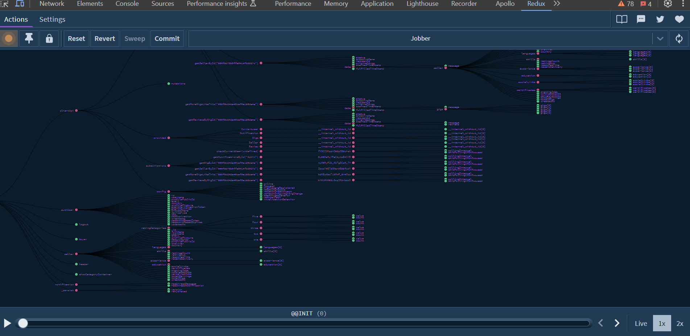

## Jobber Application

- This application is built using these main tools
  - `Vite`
  - `React`
  - `Typescript`
  - `Tailwindcss`
  - `Redux Toolkit`
  - `RTK Query`
  - `Stripe`
  - `Elasticsearch`
  - `Axios`
  - `React Router DOM`
  - `React Redux`
  - `React Quill`
  - `SocketIO Client`
  - `ESlint and Prettier`
- There are other tools and packages used.
- You can update the version of `NodeJS` used inside the `Dockerfile`

## REDUX STATE

