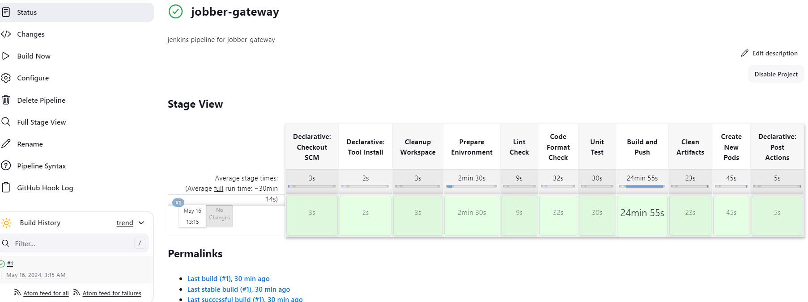
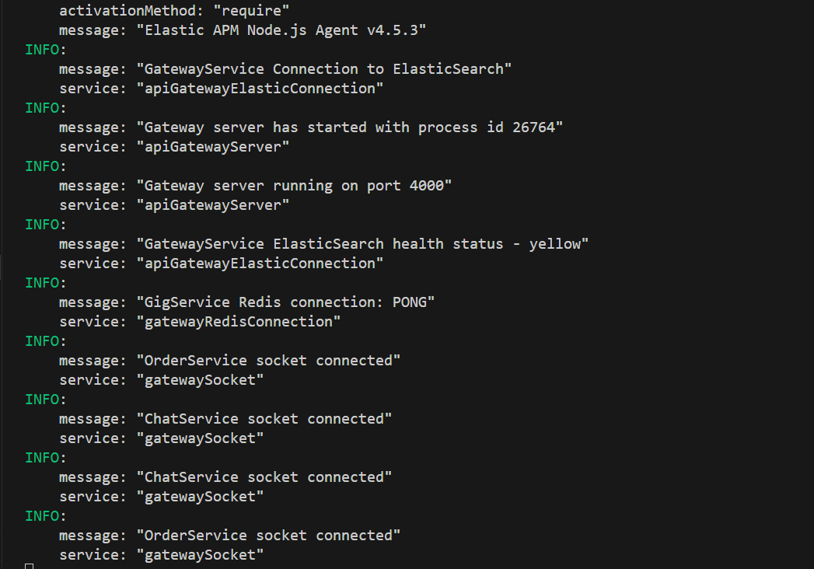

## API Gateway Microservice

- The gateway microservice is responsible for managing requests that comes from the frontend.
- Every request that comes from the frontend must pass through the `API Gateway Service`.
- The communication style used in the service is the `Request/Response` pattern.
- The gateway service is also responsible for request validation. It adds the `json web token` to the cookie session and checks if the token in a request is valid.
- All client side errors from other microservices are sent to the gateway service. The gateway service sends these errors to the client.
- Server side errors from the gateway microservice is sent to `elasticsearch` and can be viewed on `kibana`.
- Gateway service uses these tools as the main tools
  - `Your shared library`
  - `NodeJS`
  - `Express`
  - `Typescript`
  - `Axios`
  - `Redis`
  - `Elasticsearch`
  - `Json web token`
  - `SocketIO`
  - `SocketIO client`
- There are other packages that are used.
- You can update the version of `NodeJS` used inside the `Dockerfile` and `Dockerfile.dev`.

## JENKINS

## LOCAL SERVER

