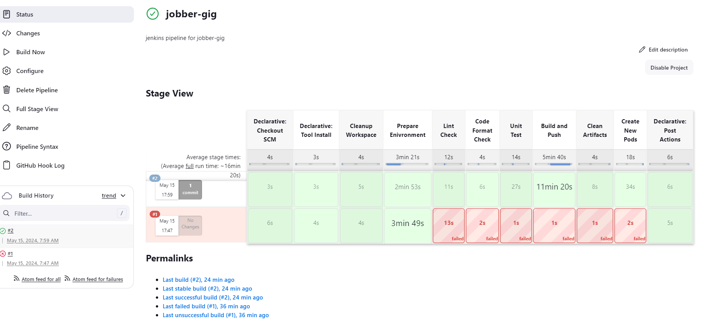
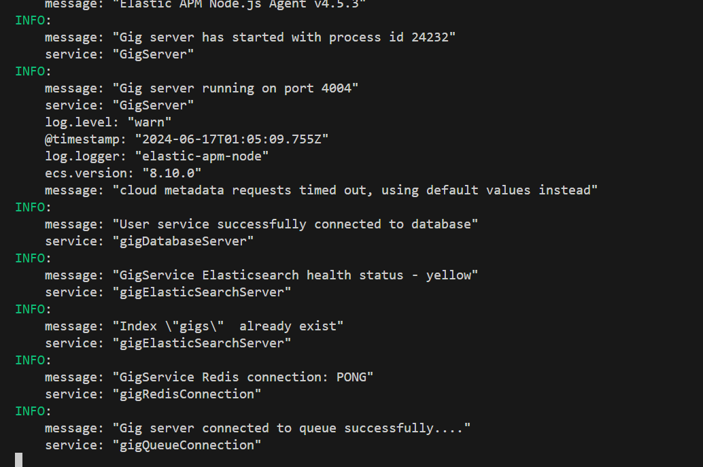

## Gig Microservice

- The gig microservice is responsible for creating and managing gigs.
- Sellers create gigs and the gigs are saved to `elasticsearch` and `mongodb`.
- `Elasticsearch` is used as the primary database storage for `creating`, `reading`, `updating` and `deleting` gigs.
- In this service, events can be `published` to other microservices and `consumed` from other microservices.
- Server side errors from the gig microservice is sent to `elasticsearch` and can be viewed on `kibana`.
- Gig service uses these tools as the main tools
  - `Your shared library`
  - `NodeJS`
  - `Express`
  - `Typescript`
  - `Rabbitmq`
  - `Redis`
  - `Elasticsearch`
  - `MongoDB database`
  - `Mongoose`
  - `Json web token`
  - `Faker to create seed data`
- There are other packages that are used.
- You can update the version of `NodeJS` used inside the `Dockerfile` and `Dockerfile.dev`.

## JENKINS

## LOCAL SERVER

