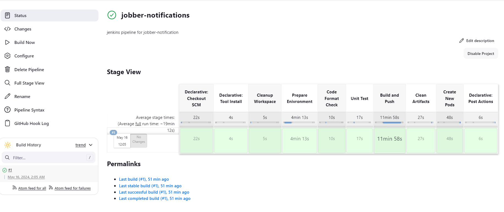

## Notification Microservice

- The notification microservice is responsible for sending out email notifications to users.
- The email templates available are for
  - `forgot password`
  - `verify email`
  - `reset password success`
  - `offer`
  - `order placed`
  - `order receipt`
  - `order extension request`
  - `order extension approval`
  - `order delivered`
- Notification service uses these tools as the main tools
  - `Your shared library`
  - `NodeJS`
  - `Express`
  - `Typescript`
  - `Rabbitmq`
  - `Elasticsearch`
  - `Nodemailer`
  - `Email templates`
- There are other packages that are used.
- You can update the version of `NodeJS` used inside the `Dockerfile` and `Dockerfile.dev`.
  - Get a sender email and password from `https://ethereal.email`
  - Add username value from `ethereal` to `SENDER_EMAIL`
  - Add password value from `ethereal` to `SENDER_EMAIL_PASSWORD`
- In order to see the emails, you have to keep the same `ethereal` page open. If you close the page, you will have to recreate the email and password and add them to your `.env` file.
- You can start the service with `npm run dev`.

## JENKINS

## LOCAL SERVER

