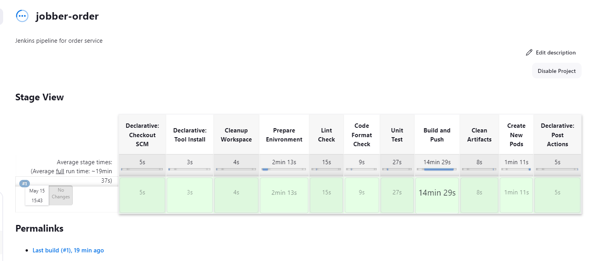
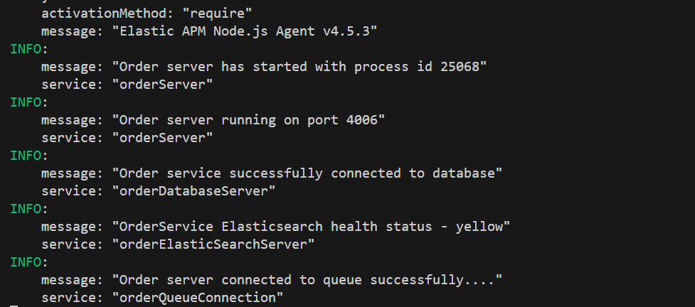

## Order Microservice

- The order microservice is responsible for managing orders created by buyers and managing orders worked on by sellers.
- In this service, events can be `published` to other microservices and `consumed` from other microservices.
- Server side errors from the order microservice is sent to `elasticsearch` and can be viewed on `kibana`.
- Order service uses these tools as the main tools
  - `Your shared library`
  - `NodeJS`
  - `Express`
  - `Typescript`
  - `Rabbitmq`
  - `Stripe API`
  - `Elasticsearch`
  - `MongoDB database`
  - `Mongoose`
  - `Json web token`
  - `SocketIO`
- There are other packages that are used.
- You can update the version of `NodeJS` used inside the `Dockerfile` and `Dockerfile.dev`.

## JENKINS

## LOCAL SERVER

