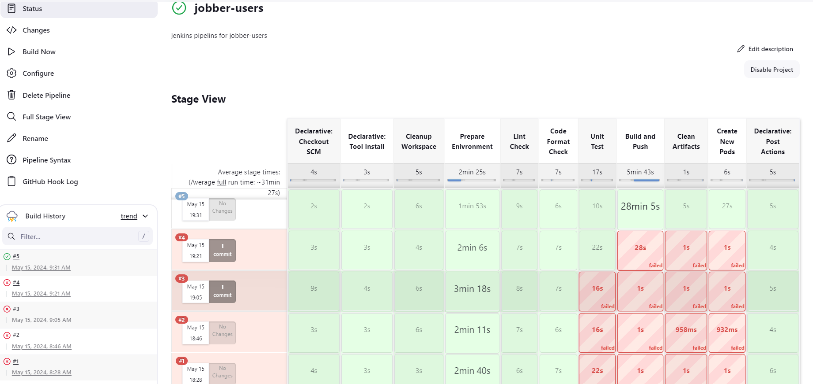
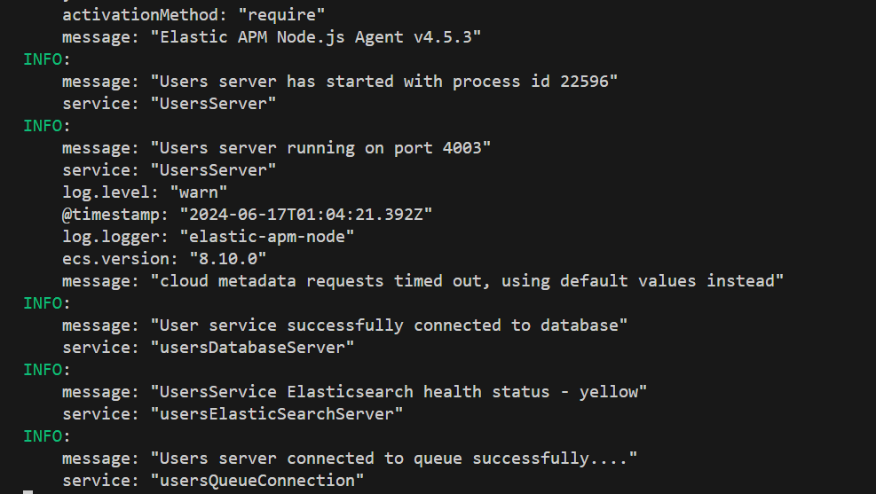

## Users Microservice

- The users microservice is responsible for creating sellers and managing sellers and buyers.
- A buyer can become a seller by creating a profile.
- Sellers can update profile, view sellers dashboard information.
- In this service, events can be `published` to other microservices and `consumed` from other microservices.
- Server side errors from the users microservice is sent to `elasticsearch` and can be viewed on `kibana`.
- Users service uses these tools as the main tools
  - `Your shared library`
  - `NodeJS`
  - `Express`
  - `Typescript`
  - `Rabbitmq`
  - `Elasticsearch`
  - `MongoDB database`
  - `Mongoose`
  - `Json web token`
  - `Faker to create seed data`
- There are other packages that are used.
- You can update the version of `NodeJS` used inside the `Dockerfile` and `Dockerfile.dev`.
- Make sure you already have your own shared library published.

## JENKINS

## LOCAL SERVER

